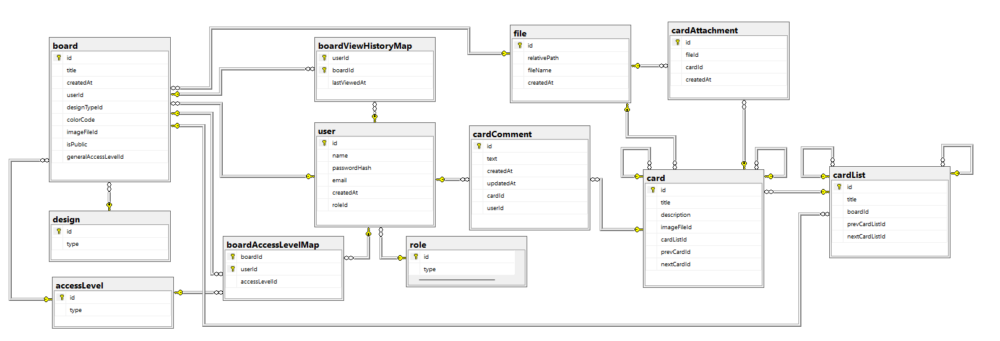
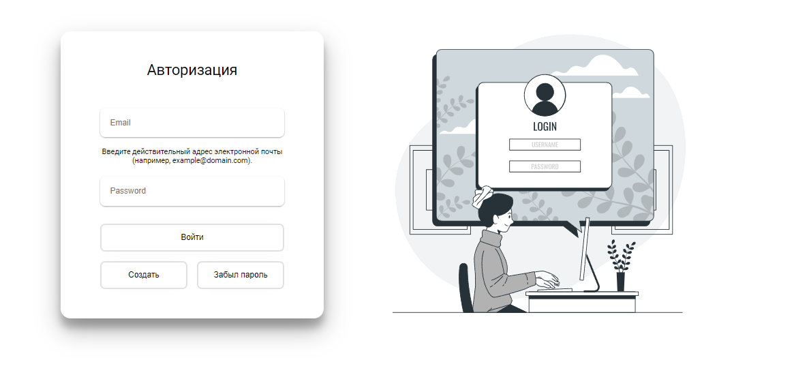
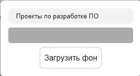
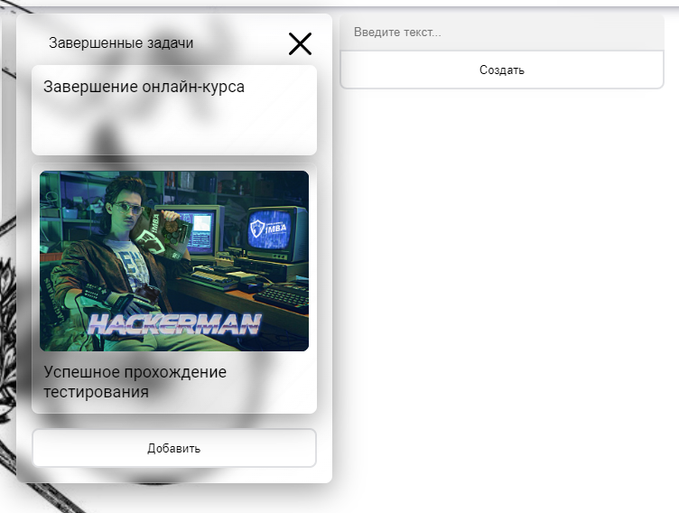
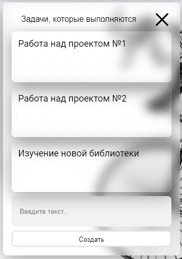
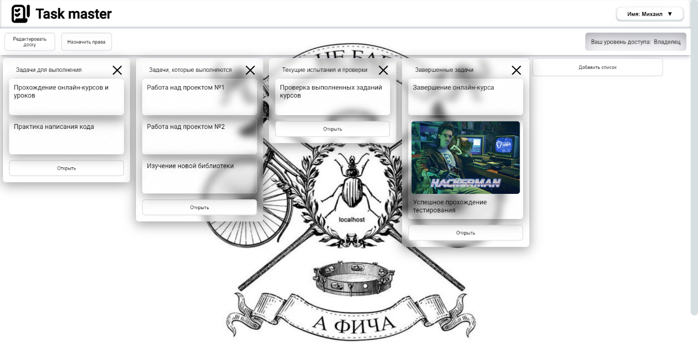
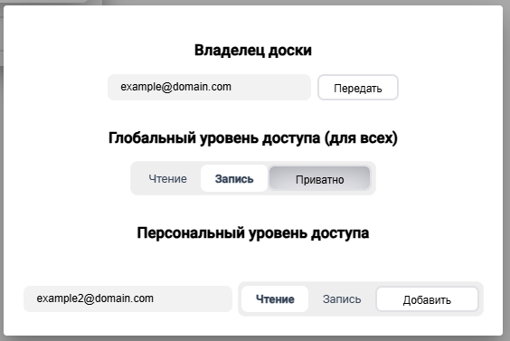
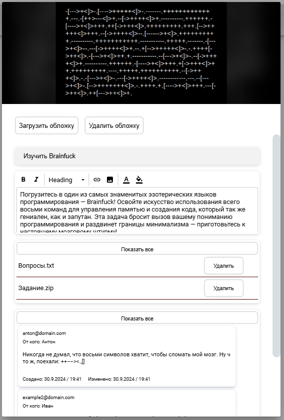
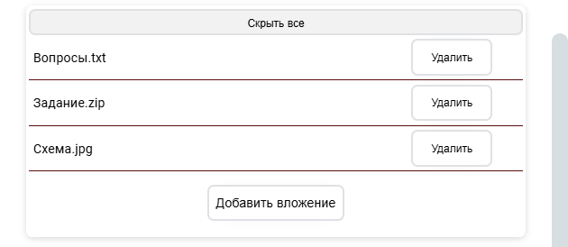
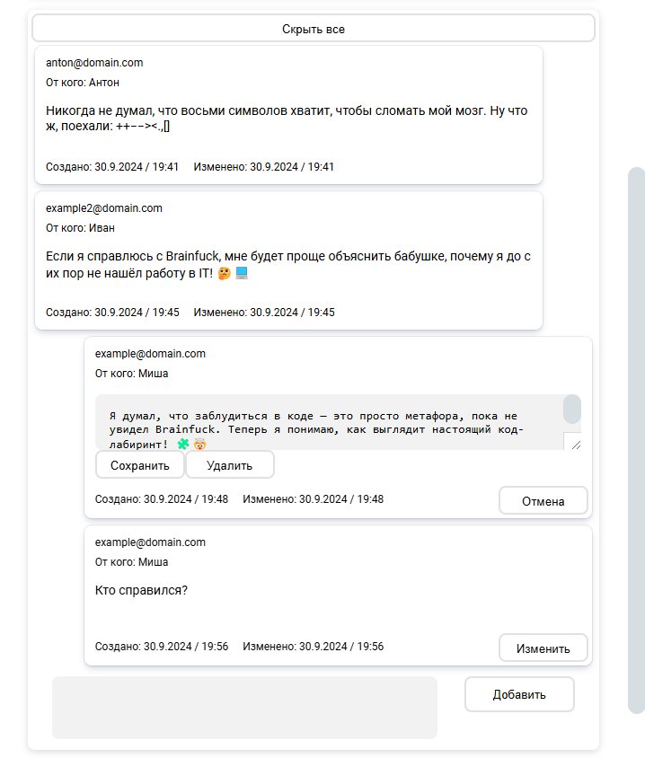

#Pазработка облачного сервиса для управления проектами небольших групп по системе «канбан»

# Описание технологий проекта

### Frontend

- **Angular** — фреймворк для создания SPA с модульной архитектурой и декларативным подходом.
- **SignalR** — библиотека для обновления данных в реальном времени, использована для обновлений карточек Kanban.
- **HttpClient** — модуль для выполнения HTTP-запросов к серверу, взаимодействующий с REST API.
- **ngx-editor** — компонент для редактирования текста, применён для описания карточек Kanban.
- **Angular Material** и **Angular CDK** — библиотеки для создания элементов интерфейса, включая поддержку drag-and-drop.

### Backend

- **ASP.NET Core** — фреймворк для разработки высокопроизводительных веб-API на C#.
- **SignalR** — библиотека для двусторонней связи и обновлений данных в реальном времени.
- **REST API** — архитектура для стандартизированного обмена данными между клиентом и сервером.
- **Entity Framework Core** — ORM для работы с данными в базе.
- **Microsoft SQL Server** — реляционная база данных для надёжного хранения данных проекта.

### База данных

### Архитектура приложения

### Руководство пользователя

#### Регистрация нового пользователя

Процесс регистрации включает следующие шаги:

1. Заполнение формы регистрации:
   1. Ввести имя.
   2. Указать адрес электронной почты.
   3. Придумать и ввести пароль.
   4. Повторить пароль для подтверждения.
2. Требования к паролю:
   1. Длина пароля должна быть от 8 до 128 символов.
   2. Пароль должен содержать хотя бы одну строчную букву.
   3. Пароль должен содержать хотя бы одну прописную букву.
   4. Пароль должен включать хотя бы одну цифру.
   5. Пароль должен включать хотя бы один специальный символ.
   6. Пример пароля: «P@ssw0rd123!»
3. Подтверждение электронной почты:
   1. После отправки формы регистрации на указанный адрес электронной почты будет отправлено письмо с ссылкой для подтверждения.
   2. Перейти по ссылке в письме для подтверждения владения электронной почтой.
   3. Доступ к главной странице:

После подтверждения электронной почты станет доступен вход на главную страницу обзора досок.

#### Авторизация пользователя

Для входа в систему необходимо:

1. Использование данных регистрации:
   1. Ввести адрес электронной почты, указанный при регистрации.
   2. Ввести пароль, созданный при регистрации.
2. Доступ к главной странице:
   1. После успешного входа происходит перенаправление на главную страницу обзора досок

#### Восстановление пароля

Если пароль забыт или требуется его изменить, нужно выполнить следующие действия:

1. Заполнение формы восстановления пароля:
   1. Ввести адрес электронной почты, использованный при регистрации.
   2. Ввести новый пароль.
   3. Повторить новый пароль для подтверждения.
2. Требования к новому паролю:
   1. Длина пароля должна быть от 8 до 128 символов.
   2. Пароль должен содержать хотя бы одну строчную букву.
   3. Пароль должен содержать хотя бы одну прописную букву.
   4. Пароль должен включать хотя бы одну цифру.
   5. Пароль должен включать хотя бы один специальный символ.
   6. Пример пароля: «N3wP@ssw0rd!»
3. Подтверждение электронной почты:
   1. На указанный адрес электронной почты будет отправлено письмо с ссылкой для подтверждения.
   2. Перейти по ссылке в письме для подтверждения изменений.
4. Смена пароля и авторизация:
   1. После подтверждения почты пароль будет изменен.
   2. Происходит перенаправление на страницу авторизации для входа с новым паролем.

#### Обзор досок

Обзор досок предоставляет пользователю информацию о наличии досок, а также позволяет осуществлять управление ими. В верхней части страницы пользователь может увидеть свое имя, роль и электронную почту. Также предоставлена кнопка «Выход», при нажатии на которую пользователь завершает сеанс и перенаправляется на страницу авторизации.
Страница обзора досок содержит две вкладки: «Доски» и «Общие доски». Во вкладке «Общие доски» размещены два раздела: «Последние открытые доски» и «Мои доски». В разделе «Последние открытые доски» пользователь может просмотреть последние 10 досок, в которые он заходил. В разделе «Мои доски» отображаются доски, принадлежащие пользователю.
Над списком досок в разделе «Мои доски» находятся две кнопки: «Выбрать» и «Удалить выбранное». Пользователь может выбрать несколько досок и удалить их, нажав на соответствующую кнопку. В разделе также присутствует блок «Создать доску», который при нажатии преобразуется в форму для ввода заголовка новой доски. После ввода заголовка пользователь может создать новую доску, нажав на кнопку «Создать».
Ниже списка досок расположена кнопка «Еще», которая позволяет загрузить дополнительные доски.

На вкладке «Общие доски» представлены доски, доступ к которым предоставлен владельцами персонально, а также с любым другим уровнем доступа. Доски сгруппированы по владельцам, каждый блок содержит имя владельца, список его досок и кнопку «Еще» для загрузки дополнительных общих досок с данным пользователем.

При нажатии правой кнопкой мыши на одну из досок, если у пользователя есть уровень доступа для редактирования доски, появится контекстное меню или модальное окно. В этом окне пользователь может изменить заголовок доски, ее цвет или изображение. Это позволяет пользователям быстро и удобно вносить изменения в доску непосредственно из обзора досок.

#### Изменение содержимого доски

Для начала редактирования доски пользователь должен выбрать соответствующую доску на странице «Обзора досок». После этого он будет перенаправлен на страницу редактирования доски. На этой странице представлена панель управления и само содержимое доски.
В зависимости от уровня доступа к доске у пользователя могут быть разные опции:

1. Если пользователь является владельцем доски, то у него будут доступны кнопки «Назначить уровень доступа» и «Редактирование доски».
2. Если пользователь является редактором, то у него будет доступна опция «Редактирование доски».
3. Пользователь с уровнем доступа «Читатель» не будет видеть данных кнопок.
   На правой части панели управления есть поле со статусом текущего уровня доступа к доске.
   При нажатии на кнопку «Редактирование доски» появится модальное окно, в котором пользователь сможет изменить заголовок, цвет или изображение доски.
   Ниже представлен сам контент доски, включающий в себя списки и карточки. Их можно перемещать как по спискам, так и между списками с помощью мыши.
   Для создания новых списков есть кнопка «Добавить список». После ее нажатия раскрывается поле для ввода заголовка нового списка, а также кнопка «Создать», по нажатию на которую появится новый список с указанным заголовком.

Для добавления новой карточки в список нужно нажать кнопку «Добавить» в соответствующем списке карточек. Появится поле для ввода заголовка и кнопка «Создать». После нажатия на кнопку появится новая карточка в списке с указанным заголовком.  

Для редактирования заголовка списка карточек пользователь должен нажать левой кнопкой мыши на поле с названием списка. Также он может нажать на «крестик» возле списка, чтобы удалить его.
Для редактирования карточки пользователь должен нажать правой кнопкой мыши на карточку. Название карточки станет редактируемым, а в углу карточки появится «крестик» для удаления карточки.

#### Назначения уровня доступа для доски

Пользователь должен нажать кнопку «Назначить уровень доступа», чтобы изменить уровень доступа к доске. После этого появится модальное окно с настройками доступа.
Модальное окно состоит из трех частей:

1. Первая часть позволяет передать доску другому пользователю, указав его электронную почту и нажав кнопку «Передать». Это действие передаст владение доской указанному пользователю.
2. Во второй части представлены глобальные настройки доступа к доске. Владелец доски может сделать ее публичной или приватной для всех пользователей и установить глобальный уровень доступа (например, «Чтение» или «Редактирование»). После этого можно разместить ссылку на доску на других ресурсах.
3. В третьей части владелец может назначить персональный уровень доступа для каждого пользователя, введя его электронную почту в соответствующее поле. Рядом с полем есть возможность выбора уровня доступа («Чтение» или «Редактирование»). После этого можно нажать кнопку «Добавить», чтобы пользователь появился в таблице выше. В этой таблице также можно изменить его уровень доступа или удалить из списка пользователей с персональным уровнем доступа. При этом стоит отметить, что персональный уровень доступа имеет приоритет над глобальным.

#### Изменение содержимого карточки

Для более детального редактирования содержимого карточки необходимо щелкнуть по ней и выбрать опцию «Изменение содержимого доски». После этого откроется модальное окно с содержимым карточки.
Содержимое карточки разделено на пять частей:

1. Обложка карточки: Для добавления или изменения обложки карточки нужно нажать кнопку «Загрузить обложку» и выбрать изображение в формате .jpg. Чтобы удалить обложку, достаточно нажать «Удалить обложку».
   
2. Заголовок карточки: Для редактирования заголовка достаточно ввести новый текст в соответствующем поле. Изменения будут сохранены при переходе к другому разделу экрана.
   
3. Описание карточки: Для редактирования описания нужно нажать на поле с редактором, после чего он раскроется под размер текста. Здесь можно изменять текст с минимальным функционалом.
   
4. Вложения карточки: Для добавления файлов нужно нажать кнопку «Добавить вложение», выбрать файлы для загрузки и нажать «Открыть». При необходимости можно загрузить несколько файлов с одинаковым именем, к второму из них автоматически будет добавлен номер.
   
5. Комментарии карточки: Доступны для добавления новых комментариев и просмотра всех существующих. Для добавления комментария необходимо ввести текст в соответствующее поле и нажать кнопку «Добавить». Комментарии разделены на комментарии пользователя и других пользователей доски. Каждый комментарий содержит информацию о создателе, время создания и последнего изменения, а также сам текст комментария. Пользователь может изменить свой комментарий, нажав кнопку «Изменить» внизу комментария, после чего поле с текстом станет редактируемым. После внесения изменений пользователь может нажать «Изменить» или «Отмена», в зависимости от дальнейших действий.
   

---
**Дата создания**: Создан: 29.11.2024 